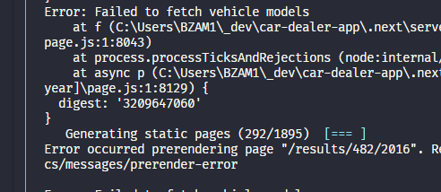
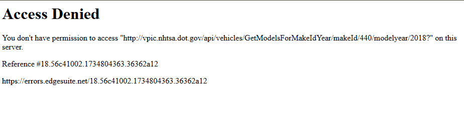
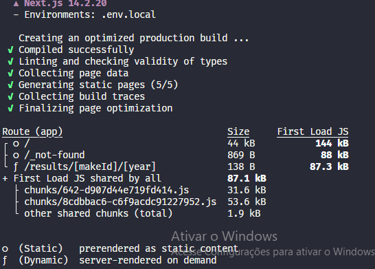

# Disclaimer

1. The static page generation was implemented, however, when it was building the 1800~ pages, various times my access to the api was blocked. Even putting a delay at the query, it didn't work well, so I left the code in the project, but the individual fetching still works well.

|  |
| :--------------------: |
|      _Build logs_      |

|  |
| :----------------------: |
|     _Html response_      |

|  |
| :----------------------: |
|     _Build without static generation_      |

2. As we are working with a form, I feel more comfortable using the use query props to deal with the request state rendering, however, I know how and when to use this feature.

## Getting Started

Run the development server:

```bash
npm run dev
# or
yarn dev
# or
pnpm dev
# or
bun dev
```

Open [http://localhost:3000](http://localhost:3000) with your browser to see the result.
